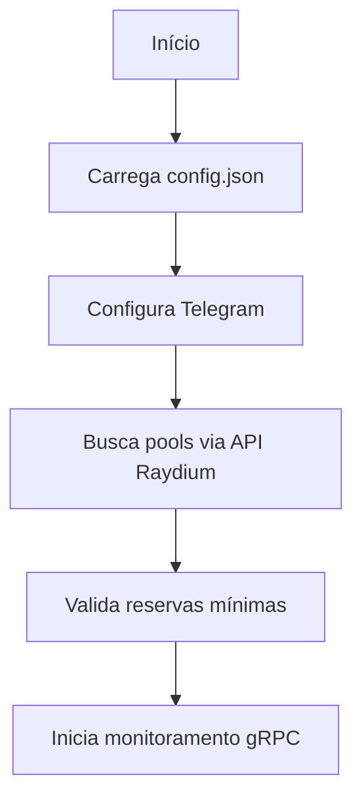
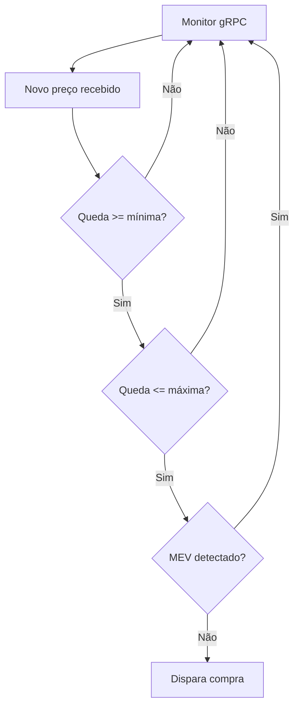
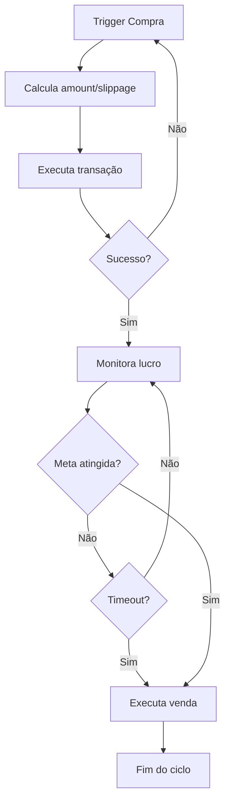

# Bot de Trading Raydium Multi-Pool 🤖

## 📋 Visão Geral

Este é um bot de trading automatizado para a blockchain Solana que monitora múltiplas pools da Raydium simultaneamente, detecta oportunidades de negociação baseadas em quedas de preço e executa operações de compra e venda automatizadas. O sistema utiliza tecnologia gRPC para monitoramento em tempo real e inclui proteções contra MEV (Maximal Extractable Value).

## 🚀 Características Principais

### ⚡ Monitoramento em Tempo Real
- **gRPC Streaming**: Utiliza conexão gRPC com Helius para dados em tempo real
- **Multi-Pool**: Monitora até 200+ tokens simultaneamente
- **Baixa Latência**: Processamento de dados sub-segundo

### 🛡️ Proteções Avançadas
- **Proteção MEV**: Detecta e ignora manipulações de preço suspeitas
- **Validação de Transações**: Verificação detalhada de status das transações
- **Timeout Configurável**: Evita operações presas indefinidamente

### 📱 Sistema de Notificações
- **Telegram Integration**: Notificações instantâneas via bot do Telegram
- **Alertas de Trading**: Compras, vendas, lucros e erros
- **Relatórios Diários**: Resumos automáticos de performance
- **Monitoramento de Status**: Acompanhamento do uptime e estatísticas

### 💎 Trading Inteligente
- **Detecção de Queda**: Configuração flexível de percentuais mínimos e máximos
- **Auto-Profit Taking**: Venda automática quando meta de lucro é atingida
- **Configurações Granulares**: Priority fees, compute prices, slippage personalizáveis

## 🛠️ Arquitetura do Sistema

### Componentes Principais

#### 1. **monitor_grpc.py** - Monitor de Preços
```python
class PriceMonitorGRPC:
    # Conecta ao Geyser via gRPC
    # Monitora pools da Raydium
    # Decodifica liquidity state
    # Stream de preços em tempo real
```

**Funcionalidades:**
- Conexão segura com Helius gRPC
- Decodificação de dados binários das pools
- Cálculo automático de preços baseado em reserves
- Gerenciamento de vaults (base/quote)

#### 2. **trader.py** - Executor de Trades
```python
class RaydiumTrader:
    # Executa compras via BloxRoute Solana
    # Executa vendas com retry logic
    # Verifica status de transações
    # Calcula slippage e fees
```

**Funcionalidades:**
- Integração com BloxRoute Solana API
- Cálculo automático de amounts e slippage
- Sistema de retry para transações falhadas
- Verificação de confirmação de transações

#### 3. **telegram_notifier.py** - Sistema de Notificações
```python
class TelegramNotifier:
    # Envia notificações formatadas
    # Calcula valores em USD
    # Gera relatórios e estatísticas
    # Gerencia status do bot
```

**Funcionalidades:**
- Notificações HTML formatadas
- Integração com CoinGecko para preços USD
- Links diretos para Solscan
- Estatísticas de performance em tempo real

#### 4. **multi_pool_bot.py** - Coordenador Principal
```python
async def central_manager():
    # Carrega configurações
    # Configura pools via API Raydium
    # Coordena monitoramento
    # Executa ciclos de trading
```

**Funcionalidades:**
- Gerenciamento de ciclo de vida completo
- Configuração automática de pools via API
- Detecção e resposta a oportunidades
- Recovery e restart automático

## 📊 Fluxo de Operação

### 1. **Inicialização**


### 2. **Detecção de Oportunidade**


### 3. **Execução de Trade**


## ⚙️ Configuração

### Arquivo config.json
```json
{
  "owner_address": "SUA_WALLET_AQUI",
  "price_drop_percentage": 0.01,
  "max_price_drop_percentage": 27,
  "profit_target_percentage": 3,
  "profit_timeout_minutes": 1000,
  "trade_amount": 0.001,
  "slippage": 27,
  "min_sol_reserve": 500,
  "mev_protection_pump_threshold": 6,
  "mev_protection_time_window": 5,
  "buy_settings": {
    "priority_fee_sol": 0.001,
    "compute_price_sol": 0.001
  },
  "sell_settings": {
    "priority_fee_sol": 0.001,
    "compute_price_sol": 0.001
  },
  "tokens_to_monitor": [
    {
      "out_token": "ENDEREÇO_DO_TOKEN"
    }
  ]
}
```

### Variáveis de Ambiente (.env)
```bash
# Chaves de API
AUTH_HEADER=sua_bx_auth_header
PUBLIC_KEY=sua_public_key
PRIVATE_KEY=sua_private_key_base58
HELIUS_API_KEY=sua_helius_api_key

# gRPC Configuration
GRPC_RPC_FQDN=helius_grpc_endpoint
GRPC_X_TOKEN=seu_grpc_token

# Telegram
TELEGRAM_BOT_TOKEN=seu_bot_token
TELEGRAM_CHAT_ID=seu_chat_id
```

## 📦 Instalação e Execução

### Pré-requisitos
- Python 3.8+
- Wallet Solana com SOL para trading
- API Keys configuradas

### Instalação
```bash
# Clone o repositório
git clone <repository-url>
cd Bot_GRPC_raydium

# Instale dependências
pip install -r requirements.txt

# Configure variáveis de ambiente
cp .env.example .env
# Edite .env com suas credenciais

# Configure tokens para monitorar
# Edite config.json
```

### Execução
```bash
python multi_pool_bot.py
```

## 📊 Métricas e Monitoramento

### Métricas em Tempo Real
- **Pools Monitoradas**: Quantidade de tokens ativos
- **Uptime**: Tempo de operação contínua
- **Taxa de Sucesso**: Percentual de trades lucrativos
- **Lucro Acumulado**: Total em SOL e USD
- **Tempo de Execução**: Latência de detecção à execução

### Logs e Debug
- **Arquivo de Log**: `logs/bot.log`
- **Console Output**: Informações formatadas com cores
- **Telegram Alerts**: Erros e status críticos

## 🛡️ Recursos de Segurança

### Proteção MEV
```python
# Detecta pumps suspeitos
if alta_repentina >= mev_threshold:
    recent_pump_detected = True
    
# Ignora quedas após pumps
if recent_pump_detected and queda_detectada:
    print("Possível MEV - ignorando")
    continue
```

### Validação de Transações
```python
# Verificação multi-camada
tx_confirmed = await verify_transaction_status(signature)
if not tx_confirmed:
    # Retry ou abort
```

### Gerenciamento de Riscos
- **Limites de Perda**: Max drop percentage
- **Timeouts**: Evita operações presas
- **Reserva Mínima**: Filtra pools com baixa liquidez
- **Slippage Protection**: Configurável por operação

## 🔧 Dependências Principais

### Trading e Blockchain
- `bxsolana-trader`: Execução de trades na Solana
- `solana`: SDK oficial Solana
- `base58`: Codificação de endereços
- `grpcio`: Comunicação gRPC

### Monitoramento e Notificações
- `python-telegram-bot`: Notificações Telegram
- `aiohttp`: Requisições HTTP assíncronas
- `requests`: API calls

### Utilidades
- `colorama`: Output colorido no terminal
- `python-dotenv`: Gerenciamento de variáveis de ambiente
- `asyncio`: Programação assíncrona
- `tenacity`: Retry logic
- `aiolimiter`: Rate limiting

## 📈 Performance

### Métricas Típicas
- **Latência de Detecção**: ~100-500ms
- **Tempo até Execução**: ~1-3 segundos
- **Pools Simultâneas**: 200+ tokens
- **Uptime**: 99%+ com auto-recovery

### Otimizações
- **Processamento Paralelo**: Monitora todas as pools simultaneamente
- **Cache de Dados**: Evita re-fetch desnecessário
- **Connection Pooling**: Reutilização de conexões gRPC
- **Retry Logic**: Recovery automático de falhas

## 🚨 Monitoramento de Erros

### Tipos de Erro Detectados
- **Conexão gRPC**: Falhas de rede
- **API Errors**: Rate limits, timeouts
- **Transaction Failures**: Falhas na blockchain
- **Configuration Issues**: Configurações inválidas

### Resposta a Erros
- **Auto-Retry**: Reconnect automático
- **Telegram Alerts**: Notificação imediata
- **Graceful Degradation**: Operação parcial quando possível
- **Detailed Logging**: Debug completo

## 🎯 Casos de Uso

### Trading Ativo
- Detecção automática de dips
- Execução rápida de compras
- Profit-taking automatizado
- Proteção contra MEV

### Portfolio Management
- Diversificação automática
- Rebalanceamento baseado em oportunidades
- Stop-loss inteligente
- Acompanhamento de performance

### Research e Analytics
- Coleta de dados de mercado
- Análise de padrões de preço
- Backtesting de estratégias
- Métricas de liquidez

